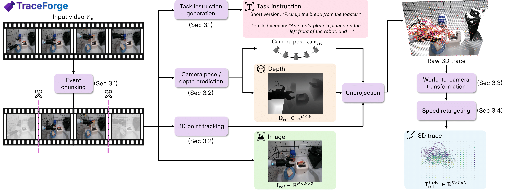
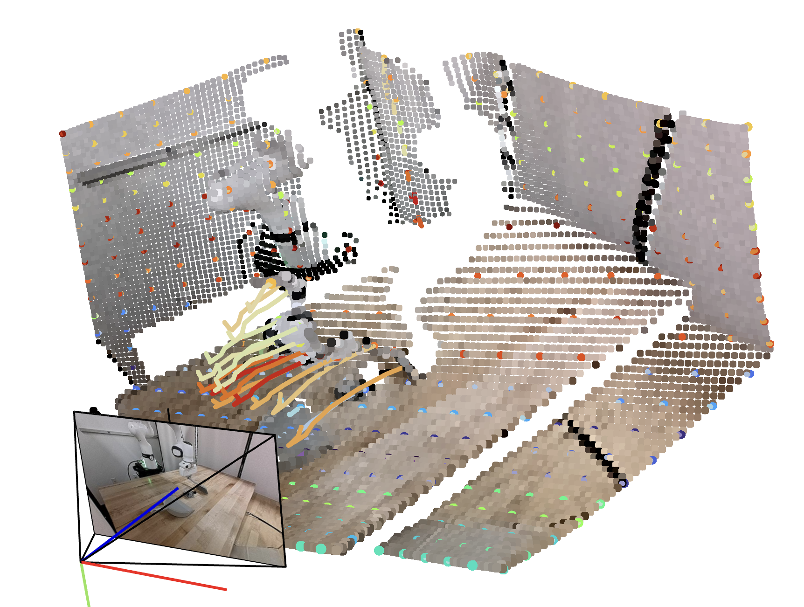

#  TraceForge

TraceForge is a unified dataset pipeline that converts cross-embodiment videos into consistent 3D traces via camera motion compensation and speed retargeting. 
For model training on the processed datasets, please refer to [TraceGen](https://github.com/jayLEE0301/TraceGen).

**Project Website**: [tracegen.github.io](https://tracegen.github.io/)  
**arXiv**: [2511.21690](https://arxiv.org/abs/2511.21690)



## Installation

### 1. Create a conda environment
```bash
conda create -n traceforge python=3.11
conda activate traceforge
```

### 2. Install dependencies 
Installs PyTorch 2.8.0 (CUDA 12.8) and all required packages.
```bash
bash setup_env.sh
```

### 3. Download checkpoints
Download the TAPIP3D model checkpoint:
```bash
mkdir -p checkpoints
wget -O checkpoints/tapip3d_final.pth https://huggingface.co/zbww/tapip3d/resolve/main/tapip3d_final.pth
```

## Usage

### Prepare videos

**Case A: videos directly in the input folder**
```
<input_video_directory>/
├── 1.webm
├── 2.webm
└── ...
```
- Use `--scan_depth 0` because the videos are already in the root folder.

**Case B: one subfolder per video containing extracted frames**
```
<input_video_directory>/
├── <video_name_1>/
│   ├── 000000.png
│   ├── 000001.png
│   └── ...
├── <video_name_2>/
│   ├── 000000.png
│   └── ...
└── ...
```
- Use `--scan_depth 1` so TraceForge scans one level down to reach each video’s frames.

**Case C: two-level layout (per-video folder with an `images/` subfolder)**
```
<input_video_directory>/
├── <video_name_1>/
│   └── images/
│       ├── 000000.png
│       ├── 000001.png
│       └── ...
├── <video_name_2>/
│   └── images/
│       ├── 000000.png
│       └── ...
└── ...
```
- Use `--scan_depth 2` to search two levels down for the image frames.

**Quick test dataset**
- Download a small sample dataset and unpack it under `data/test_dataset`:
  ```bash
  pip install gdown  # if not installed
  mkdir -p data
  gdown --fuzzy https://drive.google.com/file/d/1Vn1FNbthz-K8o2ijq9V7jYv10rElWuUd/view?usp=sharing -O data/test_dataset.tar
  tar -xf data/test_dataset.tar -C data
  ```
- The downloaded data follows the Case B layout above; run inference with 
    ```bash
    python infer.py \
        --video_path data/test_dataset \
        --out_dir <output_directory> \
        --batch_process \
        --use_all_trajectories \
        --skip_existing \
        --frame_drop_rate 5 \
        --scan_depth 1 \
        --grid_size 20  # Optional: increase for higher keypoint density
    ```

### Running Inference

#### Single Video Processing
```bash
python infer.py \
    --video_path <input_video_directory> \
    --out_dir <output_directory> \
    --batch_process \
    --use_all_trajectories \
    --skip_existing \
    --frame_drop_rate 5 \
    --scan_depth 2 \
    --grid_size 20  # Optional: increase for higher keypoint density (default: 20)
```

#### Batch Processing with Multiple GPUs
For processing large datasets with multiple GPUs in parallel:
```bash
python batch_infer.py \
    --base_path <dataset_base_path> \
    --out_dir <output_directory> \
    --gpu_id 0,1,2,3,4,5,6,7 \
    --use_all_trajectories \
    --skip_existing \
    --frame_drop_rate 5 \
    --grid_size 30 \
    --max_trajs 10  # Limit for testing
```

**Batch Processing Options**:
- `--gpu_id`: Specify GPU IDs (e.g., `0,1,2,3` for 4 GPUs)
- `--max_trajs`: Limit number of trajectories for testing
- `--max_workers`: Control parallelism (default: equal to GPU count)
- `--no_parallel`: Disable parallel processing (serial mode)
- `--grid_size`: Grid size for uniform keypoint sampling (grid_size × grid_size points per frame). Default is `20` (400 points). Higher values increase keypoint density (e.g., `30` = 900 points, `40` = 1600 points)

#### Options
| Argument | Description | Default |
|----------|-------------|---------|
| `--video_path` | Path to video directory | Required |
| `--out_dir` | Output directory | `outputs` |
| `--batch_process` | Process all video folders in the directory | `False` |
| `--skip_existing` | Skip if output already exists | `False` |
| `--frame_drop_rate` | Query points every N frames | `1` |
| `--scan_depth` | Directory levels to scan for subfolders | `2` |
| `--fps` | Frame sampling stride (0 for auto) | `1` |
| `--max_frames_per_video` | Target max frames per episode | `50` |
| `--future_len` | Tracking window length per query frame | `128` |
| `--grid_size` | Grid size for uniform keypoint sampling (grid_size × grid_size points per frame) | `20` |

### Output Structure
```
<output_dir>/
└── <video_name>/
    ├── images/
    │   ├── <video_name>_0.png
    │   ├── <video_name>_5.png
    │   └── ...
    ├── depth/
    │   ├── <video_name>_0.png
    │   ├── <video_name>_0_raw.npz
    │   └── ...
    ├── samples/
    │   ├── <video_name>_0.npz
    │   ├── <video_name>_5.npz
    │   └── ...
    └── <video_name>.npz          # Full video visualization data
```

## Visualization

### 3D Trajectory Viewer
Visualize 3D traces on single images using viser. The visualization automatically adapts to different `grid_size` values:



```bash
python visualize_single_image.py \
    --npz_path <output_dir>/<video_name>/samples/<video_name>_0.npz \
    --image_path <output_dir>/<video_name>/images/<video_name>_0.png \
    --depth_path <output_dir>/<video_name>/depth/<video_name>_0.png \
    --port 8080
```

**Interactive Controls**:
- **Number of trajectories**: Adjust how many trajectories to display (useful for high-density keypoints, e.g., grid_size=80 with 6400 trajectories)
- **Number of keypoints**: Adjust how many keypoints to display
- **Track width**: Adjust trajectory line width (0.5-10.0)
- **Keypoint size**: Adjust keypoint point size (0.001-0.1)
- **Track length**: Control the length of displayed trajectory segments
- **Show/Hide toggles**: Control visibility of point cloud, tracks, keypoints, camera frustum, and axes

**Note**: The visualization script automatically handles different keypoint densities based on the `grid_size` used during inference. Use the interactive controls to adjust rendering for optimal performance and clarity.

### Verify Output Files
Check saved NPZ files:
```bash
# 3D trajectory checker
python checker/batch_process_result_checker_3d.py <output_dir> --max-videos 1 --max-samples 3

# 2D trajectory checker
python checker/batch_process_result_checker.py <output_dir> --max-videos 1 --max-samples 3
```

## Instruction Generation

Generate task descriptions using VLM (Vision-Language Model).

### Setup API Keys
Create a `.env` file in the project root:
```bash
# For OpenAI (default)
OPENAI_API_KEY=your_openai_api_key

# For Google Gemini
GOOGLE_API_KEY=your_gemini_api_key
```

### Generate Descriptions
```bash
cd text_generation/
python generate_description.py --episode_dir <dataset_directory>

# Skip episodes that already have descriptions
python generate_description.py --episode_dir <dataset_directory> --skip_existing
```

## Helper Functions

- **Reading 3D data**: See `ThreedReader` in `visualize_single_image.py`
- **Point and camera transformations**: See `utils/threed_utils.py`

## Troubleshooting

### 多GPU并行处理问题

**问题**: 在多GPU环境下运行 `batch_infer.py` 时，非 cuda:0 设备出现 `CUDA error: an illegal memory access was encountered` 错误。

**原因**: `pointops2` 模块在创建张量时使用了硬编码的 `torch.cuda.*Tensor()`，这些会在默认设备（cuda:0）上创建张量，导致设备不匹配。

**修复**: 已修复 `third_party/pointops2/functions/pointops.py` 中的以下函数：
- `KNNQuery.forward()`: 使用输入张量的设备创建输出张量
- `FurthestSampling.forward()`: 使用输入张量的设备创建输出张量
- `Grouping.forward()` 和 `Grouping.backward()`: 使用输入张量的设备创建输出张量

**验证**: 修复后，所有GPU（cuda:0 到 cuda:7）都能正常工作。

### 深度单位转换问题

**问题**: 
1. 读取的深度图像（16-bit PNG）单位与模型输出的深度单位不一致
2. 深度值显示不合理（如厨房场景显示100-600米）

**原因**: 
- 原始深度图像（16-bit PNG）通常以**毫米**为单位存储
- 模型输出的深度以**米**为单位
- 在 `load_video_and_mask` 中加载深度时未进行单位转换

**修复**: 
1. **加载时** (`infer.py`): 添加单位转换 `depth_array / 1000.0`（毫米转米）
2. **保存时** (`infer.py`): 使用厘米单位保存PNG `depth * 100.0`（米转厘米，最大655.35米）
3. **加载时** (`visualize_single_image.py`): 从PNG加载时除以100（厘米转米）

**注意**: 
- 深度值 > 655.35米会被截断（uint16限制）
- 建议优先使用NPZ文件（`_raw.npz`）保存完整精度

### 批量推理输出检查

**改进**: `batch_infer.py` 现在会自动检查输出目录是否有内容：
- 如果输出为空，会显示警告和错误信息
- 显示每个任务生成的文件数量
- 帮助快速定位失败的任务

### Keypoint密度调整

**功能**: `grid_size` 参数现在可以动态调整，用于控制每帧采样的关键点数量。

**使用方法**:
- `--grid_size 20` (默认): 每帧 20×20 = 400 个关键点
- `--grid_size 30`: 每帧 30×30 = 900 个关键点
- `--grid_size 40`: 每帧 40×40 = 1600 个关键点

**注意**:
- `support_grid_size` 会自动按比例适配（比例为 0.8，即 `grid_size × 0.8`）
- 更高的 `grid_size` 会增加计算时间和内存使用
- 可视化脚本 `visualize_single_image.py` 会自动适配不同的 keypoint 密度，无需额外配置

### CUDA版本不匹配问题

**问题**: 编译 `pointops2` 时出现 CUDA 版本不匹配错误（如检测到13.1但PyTorch用12.8编译）。

**临时解决方案**: 已修改 `torch/utils/cpp_extension.py` 将CUDA版本检查从错误改为警告，允许继续编译。

**注意**: 这是临时修复，建议使用匹配的CUDA版本。

## 📖 Citation

If you find this work useful, please consider citing our paper:

```bibtex
@article{lee2025tracegen,
  title={TraceGen: World Modeling in 3D Trace Space Enables Learning from Cross-Embodiment Videos},
  author={Lee, Seungjae and Jung, Yoonkyo and Chun, Inkook and Lee, Yao-Chih and Cai, Zikui and Huang, Hongjia and Talreja, Aayush and Dao, Tan Dat and Liang, Yongyuan and Huang, Jia-Bin and Huang, Furong},
  journal={arXiv preprint arXiv:2511.21690},
  year={2025}
}
```
