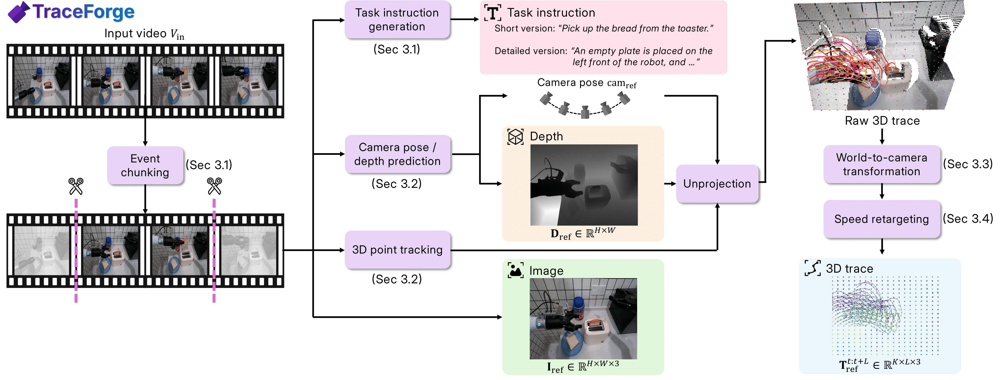
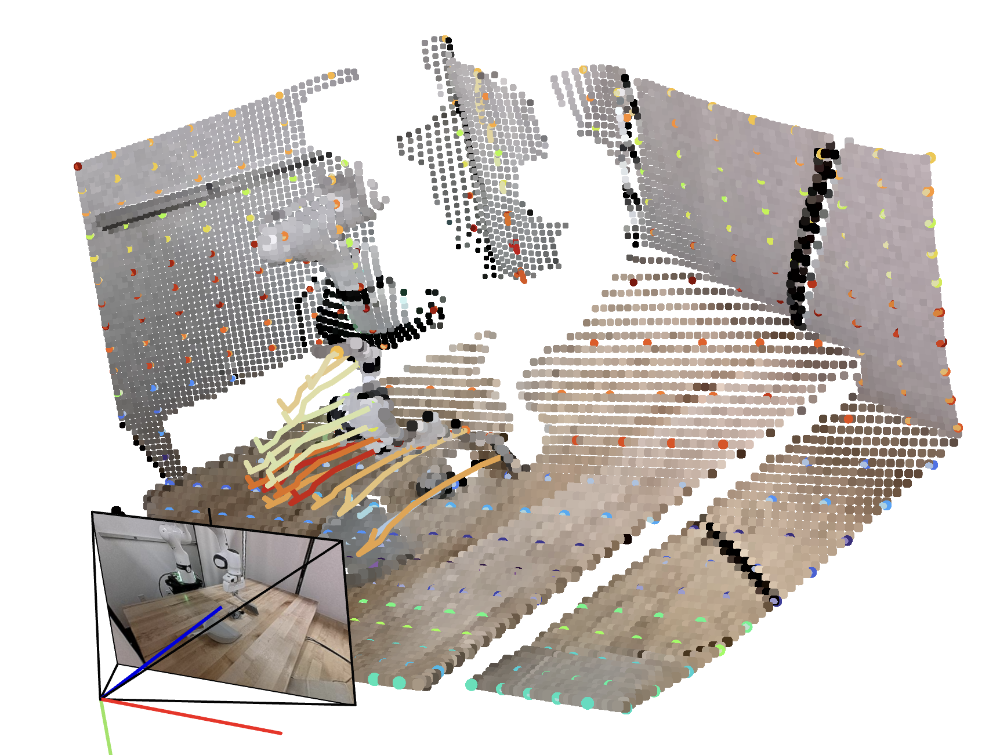

#  TraceForge

TraceForge is a unified dataset pipeline that converts cross-embodiment videos into consistent 3D traces via camera motion compensation and speed retargeting. 
For model training on the processed datasets, please refer to [TraceGen](https://github.com/jayLEE0301/TraceGen).

## Branch Notes: `traj_2d`

This branch is based on the original TraceForge code path and keeps the
automatic VGGT4 depth/camera frontend. Unlike the upstream output retargeting
behavior, saved sample trajectories are frame-aligned:

- `traj` is padded to `--future_len` without arc-length retiming, so each valid
  step corresponds to the same RGB frame step in the input segment.
- `traj_2d` is saved alongside `traj` and is padded with the same `valid_steps`
  convention.
- `segment_frame_indices` records the source frame index for every valid step.
- Padded tail values are `inf`; use `valid_steps` to mask invalid padded steps.

The local environment is maintained with `uv` and a repository-local `.venv`.

**Project Website**: [tracegen.github.io](https://tracegen.github.io/)  
**arXiv**: [2511.21690](https://arxiv.org/abs/2511.21690)



## Installation

### 1. Create a uv environment
```bash
uv venv --python 3.11 .venv
source .venv/bin/activate
```

### 2. Install dependencies 
Installs PyTorch 2.8.0 (CUDA 12.8) and all required packages.
```bash
uv pip install torch==2.8.0 torchvision==0.23.0 --index-url https://download.pytorch.org/whl/cu128
uv pip install git+https://github.com/facebookresearch/segment-anything.git
uv pip install git+https://github.com/EasternJournalist/utils3d.git#egg=utils3d
uv pip install kornia==0.8.1 huggingface_hub hydra-core omegaconf timm PyJWT gdown rich "ray[default]" jaxtyping tqdm
uv pip install torch-scatter -f https://data.pyg.org/whl/torch-2.8.0+cu128.html
uv pip install av typed-argument-parser scipy h5py sophuspy trimesh "python-box[all]~=7.0"
uv pip install wandb loguru opencv-python einops matplotlib Pillow viser mediapy scikit-learn
uv pip install python-dotenv openai google-genai flow_vis moviepy==1.0.0 easydict socksio
uv pip install git+https://github.com/facebookresearch/vggt.git

cd third_party/pointops2
CUDA_HOME=/usr/local/cuda-12.8 PATH=/usr/local/cuda-12.8/bin:$PATH TORCH_CUDA_ARCH_LIST='8.0;8.6;8.9;9.0' ../../.venv/bin/python setup.py install
cd ../..
```

If `mediapy` cannot find `ffmpeg`, expose the binary bundled by
`imageio-ffmpeg`:

```bash
ln -sf "$PWD/.venv/lib/python3.11/site-packages/imageio_ffmpeg/binaries/ffmpeg-linux-x86_64-v7.0.2" .venv/bin/ffmpeg
export PATH="$PWD/.venv/bin:$PATH"
```

### 3. Download checkpoints
Download the TAPIP3D model checkpoint:
```bash
mkdir -p checkpoints
wget -O checkpoints/tapip3d_final.pth https://huggingface.co/zbww/tapip3d/resolve/main/tapip3d_final.pth
```

The default VGGT4 frontend loads `Yuxihenry/SpatialTrackerV2_Front` from the
Hugging Face cache on first use. To prefetch it:

```bash
python - <<'PY'
from huggingface_hub import snapshot_download
snapshot_download(repo_id="Yuxihenry/SpatialTrackerV2_Front")
PY
```

## Usage

### Prepare videos

**Case A: videos directly in the input folder**
```
<input_video_directory>/
├── 1.webm
├── 2.webm
└── ...
```
- Use `--scan_depth 0` because the videos are already in the root folder.

**Case B: one subfolder per video containing extracted frames**
```
<input_video_directory>/
├── <video_name_1>/
│   ├── 000000.png
│   ├── 000001.png
│   └── ...
├── <video_name_2>/
│   ├── 000000.png
│   └── ...
└── ...
```
- Use `--scan_depth 1` so TraceForge scans one level down to reach each video’s frames.

**Case C: two-level layout (per-video folder with an `images/` subfolder)**
```
<input_video_directory>/
├── <video_name_1>/
│   └── images/
│       ├── 000000.png
│       ├── 000001.png
│       └── ...
├── <video_name_2>/
│   └── images/
│       ├── 000000.png
│       └── ...
└── ...
```
- Use `--scan_depth 2` to search two levels down for the image frames.

**Quick test dataset**
- Download a small sample dataset and unpack it under `data/test_dataset`:
  ```bash
  pip install gdown  # if not installed
  mkdir -p data
  gdown --fuzzy https://drive.google.com/file/d/1Vn1FNbthz-K8o2ijq9V7jYv10rElWuUd/view?usp=sharing -O data/test_dataset.tar
  tar -xf data/test_dataset.tar -C data
  ```
- The downloaded data follows the Case B layout above; run inference with 
    ```bash
    python infer.py \
        --video_path data/test_dataset \
        --out_dir <output_directory> \
        --batch_process \
        --use_all_trajectories \
        --skip_existing \
        --frame_drop_rate 5 \
        --scan_depth 1
    ```

### Running Inference
```bash
python infer.py \
    --video_path <input_video_directory> \
    --out_dir <output_directory> \
    --batch_process \
    --use_all_trajectories \
    --skip_existing \
    --frame_drop_rate 5 \
    --scan_depth 2
```

#### Options
| Argument | Description | Default |
|----------|-------------|---------|
| `--video_path` | Path to video directory | Required |
| `--out_dir` | Output directory | `outputs` |
| `--batch_process` | Process all video folders in the directory | `False` |
| `--skip_existing` | Skip if output already exists | `False` |
| `--frame_drop_rate` | Query points every N frames | `1` |
| `--scan_depth` | Directory levels to scan for subfolders | `2` |
| `--fps` | Frame sampling stride (0 for auto) | `1` |
| `--max_frames_per_video` | Target max frames per episode | `50` |
| `--future_len` | Tracking window length per query frame | `64` |

### Output Structure
```
<output_dir>/
└── <video_name>/
    ├── images/
    │   ├── <video_name>_0.png
    │   ├── <video_name>_5.png
    │   └── ...
    ├── depth/
    │   ├── <video_name>_0.png
    │   ├── <video_name>_0_raw.npz
    │   └── ...
    ├── samples/
    │   ├── <video_name>_0.npz
    │   ├── <video_name>_5.npz
    │   └── ...
    └── <video_name>.npz          # Full video visualization data
```

Each sample NPZ contains frame-aligned trajectories:

- `traj`: `(num_points, future_len, 3)` padded 3D trajectory.
- `traj_2d`: `(num_points, future_len, 2)` padded 2D trajectory.
- `valid_steps`: `(future_len,)` mask for real frame-aligned steps.
- `segment_frame_indices`: source RGB frame indices for the valid steps.

## Visualization

### 3D Trajectory Viewer
Visualize 3D traces on single images using viser:



```bash
python visualize_single_image.py \
    --npz_path <output_dir>/<video_name>/samples/<video_name>_0.npz \
    --image_path <output_dir>/<video_name>/images/<video_name>_0.png \
    --depth_path <output_dir>/<video_name>/depth/<video_name>_0.png \
    --port 8080
```

### Verify Output Files
Check saved NPZ files:
```bash
# 3D trajectory checker
python checker/batch_process_result_checker_3d.py <output_dir> --max-videos 1 --max-samples 3

# 2D trajectory checker
python checker/batch_process_result_checker.py <output_dir> --max-videos 1 --max-samples 3
```

## Instruction Generation

Generate task descriptions using VLM (Vision-Language Model).

### Setup API Keys
Create a `.env` file in the project root:
```bash
# For OpenAI (default)
OPENAI_API_KEY=your_openai_api_key

# For Google Gemini
GOOGLE_API_KEY=your_gemini_api_key
```

### Generate Descriptions
```bash
cd text_generation/
python generate_description.py --episode_dir <dataset_directory>

# Skip episodes that already have descriptions
python generate_description.py --episode_dir <dataset_directory> --skip_existing
```

## Helper Functions

- **Reading 3D data**: See `ThreedReader` in `visualize_single_image.py`
- **Point and camera transformations**: See `utils/threed_utils.py`

## 📖 Citation

If you find this work useful, please consider citing our paper:

```bibtex
@article{lee2025tracegen,
  title={TraceGen: World Modeling in 3D Trace Space Enables Learning from Cross-Embodiment Videos},
  author={Lee, Seungjae and Jung, Yoonkyo and Chun, Inkook and Lee, Yao-Chih and Cai, Zikui and Huang, Hongjia and Talreja, Aayush and Dao, Tan Dat and Liang, Yongyuan and Huang, Jia-Bin and Huang, Furong},
  journal={arXiv preprint arXiv:2511.21690},
  year={2025}
}
```
