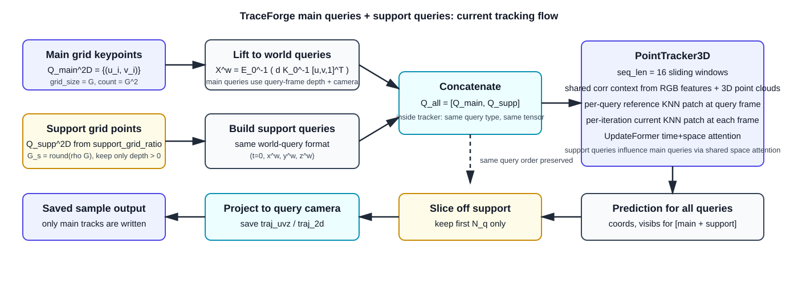

# TraceForge 底层 3D Tracking 与 Refinement 数学说明

本文面向当前仓库里的维护态推理路径，目标是把底层 tracking 的代码逻辑写成一份可以直接对照实现阅读的技术说明。

覆盖范围：

- query point / support point 的构造
- `PointTracker3D` 的滑窗跟踪主流程
- refinement 内部如何处理每一个 query point
- `support_grid_ratio` 生成的 support points 在 tracker 中到底起什么作用
- 最终为什么输出里看不到 support tracks

当前文档对应的主要代码入口：

- `scripts/batch_inference/infer.py`
- `utils/inference_utils.py`
- `models/point_tracker_3d.py`
- `models/corr_features/knn_feature_4d_optimized.py`
- `models/point_updaters/efficient_updateformer.py`
- `training_tapip/datatypes.py`

## 1. 一张简图

保存的流程图文件：

- [`traceforge_tracking_query_support_flow.svg`](traceforge_tracking_query_support_flow.svg)

文中也直接嵌入如下：

## 2. 当前实现的关键事实

### 2.1 当前维护态的 tracker 配置

基于当前仓库默认 checkpoint `checkpoints/tapip3d_final.pth` 的实测读取结果，当前维护态的几个关键配置是：

- 模型名：`point_tracker_3d_local`
- `seq_len = 16`
- `corr_levels = 4`
- `norm_mode = isotropic`
- corr processor 的 `k_neighbors = 32`
- point updater 是 `EfficientUpdateFormer`
- `time_depth = 3`
- `space_depth = 3`
- `num_virtual_tracks = 64`
- `add_space_attn = True`

同时，加载模型时会强制：

- `model.set_eval_mode("raw")`

对应代码在 [`utils/inference_utils.py`](../utils/inference_utils.py)。

这意味着：

1. tracker 的外部输入/输出都仍然使用原始世界坐标语义，而不是 query-camera local frame。
2. 但在窗口内部，`PointTracker3D` 仍然会根据 `norm_mode=isotropic` 进入“归一化工作坐标系”做 refinement，再还原回原始世界坐标。

### 2.2 本文中的两类 support 不同

这里必须先区分两件事：

1. `support_grid_ratio` 产生的 support points
   这是一批额外追加到 tracker 输入里的辅助 query。

2. corr processor 里每个 query 自己的 local support neighborhood
   这是对某个 query 在 query frame 3D 点云里找出来的一圈参考邻域。

本文重点回答的是第 1 类 support points 的作用，并在 refinement 小节中解释第 2 类局部 support 是如何参与每一步更新的。

## 3. 符号约定

设：

- 视频段长度为 `T_seg`
- tracker 单个 window 长度为 `W = 16`
- query 主网格边长为 `G = grid_size`
- support 比例为 `rho = support_grid_ratio`
- 主 query 数量为

$$
N_q = G^2
$$

- support grid 边长为

$$
G_s = \mathrm{round}(\rho G)
$$

- support query 数量上界为

$$
N_s^{max} = G_s^2
$$

- 但实际 support query 数量是深度有效后留下来的数量：

$$
N_s \le N_s^{max}
$$

对任意主 query 或 support query，都统一记为一个 4 维 query：

$$
Q_i = (t_i, X_i^w)
$$

其中：

- `t_i` 是 query 所属的时间索引
- `X_i^w = (x_i^w, y_i^w, z_i^w)` 是世界坐标系下的 3D seed

额外说明：

- 下文默认 `query_prefilter_mode=off`，也就是全部主 grid queries 都进入 tracker。
- 如果打开 query prefilter，则真正送进 tracker 的主 query 数会变成

$$
N_q^{track} \le N_q
$$

- 这时本文里所有关于“主 query 数量”的公式，都应理解为“实际进入 tracker 的主 query 数量”。
- tracking 完成后，代码会再把这批结果 scatter 回 dense grid，恢复到保存时的 `N = grid_size^2` 视图。

## 4. query 与 support query 的构造

### 4.1 主 keypoints 的 2D 网格

在 query frame 上，代码先建立一个均匀 2D 网格：

$$
\mathcal{Q}_{main}^{2D} = \{(u_i, v_i)\}_{i=1}^{N_q}
$$

其中：

$$
u_i \in \mathrm{linspace}(0, W_{img}-1, G), \quad
v_i \in \mathrm{linspace}(0, H_{img}-1, G)
$$

对应代码：

- [`_build_grid_keypoints()`](../scripts/batch_inference/infer.py)
- [`_build_frame_query_points()`](../scripts/batch_inference/infer.py)

文字解释：

- 这批点就是你最终想要保存的主轨迹种子。
- 在 sample 里看到的 `keypoints`，就是这批主网格点。

### 4.2 主 keypoints 抬升到世界坐标

对 query frame 上每个主 keypoint `(u_i, v_i)`，从 query 帧深度图中取深度 `d_i`，再结合 query 帧内参与外参，抬升到世界坐标：

相机坐标：

$$
X_i^{cam}
=
d_i \, K_0^{-1}
\begin{bmatrix}
u_i \\
v_i \\
1
\end{bmatrix}
$$

世界坐标：

$$
X_i^w
=
\left(E_0^{-1}
\begin{bmatrix}
X_i^{cam} \\
1
\end{bmatrix}\right)_{1:3}
$$

于是主 queries 为：

$$
\mathcal{Q}_{main}
=
\{(0, X_i^w)\}_{i=1}^{N_q}
$$

对应代码：

- [`prepare_query_points()`](../scripts/batch_inference/infer.py)

文字解释：

- 进入 tracker 之前，主 keypoints 已经不再是 2D 像素点，而是世界坐标里的 3D 查询点。
- 这也是为什么后面的 tracker 可以直接在 3D 空间里做 refinement。

### 4.3 `support_grid_ratio` 生成的 support queries

在 `_inference_with_grid()` 里，如果 `grid_size != 0`，代码会调用 `get_grid_queries()` 额外生成一批 support queries：

$$
\mathcal{Q}_{supp}
=
\{(0, X_j^w)\}_{j=1}^{N_s}
$$

这些点同样来自 query frame 上的均匀网格，但网格边长是 `G_s`，且只保留 query 帧深度有效的像素位置：

$$
N_s
=
\sum_{j=1}^{G_s^2}
\mathbf{1}\{d_j > 0\}
$$

对应代码：

- [`get_grid_queries()`](../utils/inference_utils.py)
- [`_inference_with_grid()`](../utils/inference_utils.py)

文字解释：

- 这批 support points 也是“真实的 3D queries”。
- 它们不是 metadata，也不是只给某个模块看的 side input。
- 它们会和主 queries 一起进入 tracker forward。

### 4.4 进入 tracker 前的最终 query 集合

进入 tracker 的总 query 集合是简单拼接：

$$
\mathcal{Q}_{all}
=
\mathcal{Q}_{main}
\cup
\mathcal{Q}_{supp}
$$

按代码里的实际顺序：

$$
Q_{all}
=
[Q_{main,1}, \dots, Q_{main,N_q},
Q_{supp,1}, \dots, Q_{supp,N_s}]
$$

对应代码：

- [`query_point = torch.cat([query_point, additional_queries], dim=1)`](../utils/inference_utils.py)

文字解释：

- tracker 看到的只是一个更长的 `query_point` 张量。
- 进入 tracker 之后，不再保留“主 query / support query”的显式类型标签。

## 5. support point 和主 keypoint 在 tracker 里有没有区别

准确结论：

**如果只看 tracker core，`support_grid_ratio` 生成的 support points 和主 keypoints 基本没有类型区别。**

更精确一点说：

1. 两者都被编码成同一种 query 表示 `Q_i = (t_i, X_i^w)`。
2. 两者都会参与 shared correlation context 构建。
3. 两者都会在每个 window 内被完整 refinement。
4. 两者都会进入 UpdateFormer，作为 point tokens 参与时空注意力。
5. 两者唯一稳定的区别是：
   - support queries 是在 `_inference_with_grid()` 里额外 append 进去的；
   - forward 结束后会被 `query_slice()` 直接裁掉。

对应的“裁掉 support”代码是：

- [`preds = preds.query_slice(slice(0, N_total - N_supports))`](../utils/inference_utils.py)
- [`Prediction.query_slice()`](../training_tapip/datatypes.py)

因此：

**是的，你可以把它理解成：support points 在 tracker 里就是和普通 keypoints 一样被 tracking；只是在输出前，代码把最后追加进去的 support tracks 删除了。**

但还需要补一句：

**它们虽然最后不保存，却会影响主 keypoints 的 refinement 结果。**

原因不是 corr processor 里主 query 会直接读取 support query 的轨迹，而是：

- 当前 checkpoint 的 updater 配置里 `add_space_attn = True`
- 所有 queries 都会进入同一个 `EfficientUpdateFormer`
- 空间注意力通过 `virtual tracks` 在 query 维度上传播上下文

所以 support queries 会通过共享的空间注意力上下文，影响主 queries 的更新。

## 6. tracker 外层主流程

### 6.1 初始状态

进入 `PointTracker3D.streaming_forward()` 后，代码先建立全时域初始预测：

$$
\hat{X}_{i,t}^{(0)} = X_i^w, \quad \forall t
$$

即把每个 query 的 3D seed 复制到整段视频的所有时间步。

同时初始化可见性 logit：

$$
\ell_{i,t}^{(0)} = 0
$$

对应代码：

- [`pred = Prediction(...)`](../models/point_tracker_3d.py)

文字解释：

- tracker 一开始并不知道这个点后面会去哪。
- 它先假设“这个点在所有帧都停在 query seed 的位置”，然后再逐轮修正。

### 6.2 构建全视频 3D 点云

对每一帧深度图，代码通过 `batch_unproject()` 把整张深度图反投影成世界坐标点云：

$$
P_t(x,y)
=
E_t^{-1}
\begin{bmatrix}
d_t(x,y) K_t^{-1}[x,y,1]^T \\
1
\end{bmatrix}_{1:3}
$$

对应代码：

- [`batch_unproject()`](../utils/common_utils.py)
- [`original_pcds = batch_unproject(...)`](../models/point_tracker_3d.py)

文字解释：

- 这一步得到的是“每一帧的稠密 3D 场景点云”。
- 后面 refinement 里，query 当前坐标会不断和这张稠密 3D 场景图去做 KNN 匹配。

### 6.3 RGB 编码

RGB 视频先经过 encoder，得到 feature maps：

$$
F_t = \mathrm{Encoder}(I_t)
$$

对应代码：

- [`encode_rgbs()`](../models/point_tracker_3d.py)

文字解释：

- 这些 feature maps 提供外观信息。
- 3D 点云提供几何信息。
- refinement 是几何和特征一起用，而不是只做几何 nearest-neighbor。

## 7. 当前实现里的滑窗 tracking

当前 checkpoint 的 `seq_len = 16`，tracker 采用半重叠滑窗：

$$
W = 16, \quad \text{stride} = W / 2 = 8
$$

window 为：

$$
[0,16), [8,24), [16,32), \dots
$$

对应代码：

- [`for window_end in range(self.seq_len, T + 1, self.seq_len // 2)`](../models/point_tracker_3d.py)

### 7.1 每个 window 的初始化

对某个 window `[a, b)`，tracker 会从上一窗口的重叠区里继承老 query 的预测，并把“还没真正开始的 query”重置回各自 seed。

记 query 的原始 query time 为 `q_i`。代码里的逻辑是：

- 若 `q_i < b - W/2`，说明这个 query 已经在上一窗口的前半段里被跟踪过，可以继承上一窗口结果；
- 否则，仍使用初始 query seed。

可以写成：

$$
\hat{X}_{i,\tau}^{init}
=
\begin{cases}
\hat{X}_{i,\tau}^{prev} & q_i < b - W/2 \\
X_i^w & \text{otherwise}
\end{cases}
$$

其中 `tau` 是 window 内部时间索引。

对应代码：

- [`coords_init = ...`](../models/point_tracker_3d.py)
- [`to_copy = query_frames < window_end - self.seq_len // 2`](../models/point_tracker_3d.py)
- [`coords_init = torch.where(...)`](../models/point_tracker_3d.py)

文字解释：

- 这保证了滑窗之间的轨迹是连续衔接的。
- support queries 和主 queries 在这里依然完全同等待遇。

### 7.2 只有已经“开始”的 query 才在当前 window 激活

当前 window 中是否跟踪某个 query，取决于：

$$
M_i^{win} = \mathbf{1}\{q_i < b\}
$$

对应代码：

- [`track_mask = query_frames < window_end`](../models/point_tracker_3d.py)

文字解释：

- 如果某个 query 的 query time 还没进入当前窗口，它不会在这个 window 里参与 refinement。

## 8. refinement 前的归一化工作坐标系

虽然外部推理语义是 `eval_mode=raw`，但当前 checkpoint 的 `norm_mode=isotropic`，因此 `_wrapped_forward_window()` 里会把 window 内 3D 点云和 queries 映射到归一化空间：

先取窗口内有效点云的均值与各向同性尺度：

$$
\mu = \mathrm{mean}(P_{a:b})
$$

$$
\sigma = \mathrm{std}(P_{a:b} - \mu)
$$

然后把 world 坐标映射成内部工作坐标：

$$
\tilde{X} = \frac{X - \mu}{\sigma} \cdot s_{norm}
$$

对应代码：

- [`_wrapped_forward_window()`](../models/point_tracker_3d.py)
- `normalized_ctx.pcds`
- `normalized_ctx.queries`
- `normalized_ctx.coords_init`

文字解释：

- refinement 真正优化的是归一化空间里的坐标 `tilde{X}`。
- 这样不同场景尺度更稳定，优化器更容易收敛。
- window 结束后，输出还会被还原回原始 world 坐标。

## 9. corr processor 如何为每个 query 建立“参考局部模板”

这一段是 refinement 的第一层核心。

### 9.1 query frame 上的 KNN reference neighborhood

对每个 query `Q_i`，corr processor 会在 query 所属帧的 3D 点云里找 `K=32` 个最近邻：

$$
\mathcal{S}_i^{(l)}
=
\mathrm{KNN}_K\left(\tilde{X}_i^{query}, \tilde{P}_{q_i}^{(l)}\right)
$$

其中：

- `l` 是 pyramid level
- `tilde{P}_{q_i}^{(l)}` 是第 `l` 层的 query-frame 3D 点云

对应代码：

- [`prepare_shared_support_ti_singlepass()`](../models/corr_features/knn_feature_4d_optimized.py)

文字解释：

- 这一步与 `support_grid_ratio` 无关。
- 这是“每个 query 自己的局部 support 邻域”，用于建立 reference patch。

### 9.2 把 query 自己也放回 reference 邻域的第一个位置

代码会显式把 query 自己放到邻域最前面：

$$
\hat{\mathcal{S}}_i^{(l)}
=
\{\tilde{X}_i^{query}\}
\cup
\mathcal{S}_i^{(l)}
$$

对应代码：

- [`support_coords = torch.cat([... query_coords ..., support_coords], dim=2)`](../models/corr_features/knn_feature_4d_optimized.py)

文字解释：

- 这意味着 reference 邻域的“锚点”永远是 query 自己。
- 后面的 offset 全部是相对这个锚点来定义。

### 9.3 reference support offsets

对 reference 邻域，代码构造相对偏移：

$$
\Delta S_{i,k}^{(l)}
=
\hat{S}_{i,k}^{(l)} - \hat{S}_{i,0}^{(l)}
$$

对应代码：

- [`support_offsets = support_coords - support_coords[:, :, :1]`](../models/corr_features/knn_feature_4d_optimized.py)

文字解释：

- 这一步把“query 周围局部几何形状”编码成一组相对位移。
- 后面 transformer 比较的不是裸坐标，而是这种局部结构模板。

## 10. refinement 内部如何处理当前 query point

这一节是最关键的。

设当前第 `m` 轮 refinement 的 query 轨迹为：

$$
\tilde{X}_{i,t}^{(m)}
$$

### 10.1 对当前 query 位置做每帧 KNN

在每个 pyramid level 上，代码都会对当前 query 坐标去每一帧的 3D 点云里找 KNN：

$$
\mathcal{N}_{i,t}^{(l,m)}
=
\mathrm{KNN}_K\left(\tilde{X}_{i,t}^{(m)}, \tilde{P}_t^{(l)}\right)
$$

对应代码：

- [`curr_knn_idxs` 构造](../models/corr_features/knn_feature_4d_optimized.py)

文字解释：

- 这是“当前 query 在第 t 帧附近，看起来最像的局部 3D 邻域”。
- 它是动态的，会随着每轮 refinement 的当前坐标而变化。

### 10.2 当前邻域相对偏移

对当前时刻的邻域，也构造相对偏移：

$$
\Delta N_{i,t,k}^{(l,m)}
=
N_{i,t,k}^{(l,m)} - \tilde{X}_{i,t}^{(m)}
$$

对应代码：

- [`neighbor_offset = neighbor_coords - curr_coords`](../models/corr_features/knn_feature_4d_optimized.py)

文字解释：

- reference support offsets 描述“query frame 里局部结构长什么样”。
- current neighbor offsets 描述“当前帧里当前估计位置附近的局部结构长什么样”。

### 10.3 对 reference patch 和 current patch 做位置编码

代码对两组偏移分别做位置编码和 MLP：

$$
e_{i,k}^{ref,(l)} = \phi_{pos}(\Delta S_{i,k}^{(l)})
$$

$$
e_{i,t,k}^{cur,(l,m)} = \phi_{pos}(\Delta N_{i,t,k}^{(l,m)})
$$

对应代码：

- [`query_support_posenc = posenc_mlp(posenc(...))`](../models/corr_features/knn_feature_4d_optimized.py)
- [`neighbor_posenc = posenc_mlp(posenc(...))`](../models/corr_features/knn_feature_4d_optimized.py)

文字解释：

- 这一步把局部几何形状从“原始坐标差值”映射到可学习表示空间。

### 10.4 加上 query / neighbor 的外观特征

对 query frame reference patch，有：

$$
r_{i,k}^{(l)} = f_{i,k}^{ref,(l)} + e_{i,k}^{ref,(l)}
$$

对当前帧 neighbor patch，有：

$$
c_{i,t,k}^{(l,m)} = f_{i,t,k}^{cur,(l)} + e_{i,t,k}^{cur,(l,m)}
$$

其中 `f` 来自 RGB feature maps 的采样结果。

### 10.5 用 NeighborTransformer 进行 reference-vs-current 比较

每个 `(i, t, l)` 都会通过一个局部 transformer，把 reference patch 和 current patch 做匹配：

$$
z_{i,t}^{(l,m)}
=
\mathrm{NeighborTransformer}
\left(
\{r_{i,k}^{(l)}\}_{k=0}^{K},
\{c_{i,t,k}^{(l,m)}\}_{k=1}^{K}
\right)
$$

对应代码：

- [`output = transformer(...)`](../models/corr_features/knn_feature_4d_optimized.py)

文字解释：

- 这一步是 refinement 的局部匹配核心。
- 对每个 query，它比较的是：
  - query frame 上“这个点附近的参考局部结构”
  - 当前帧上“当前估计位置附近的候选局部结构”
- 输出 `z_{i,t}^{(l,m)}` 可以理解成“当前位置是否 still matches query-frame local geometry”的局部相关性 embedding。

### 10.6 跨 level 拼接成 corr embedding

4 个 pyramid levels 的局部 embedding 会被拼接：

$$
corr_{i,t}^{(m)}
=
\mathrm{Concat}_{l=1}^{L}
z_{i,t}^{(l,m)}
$$

对应代码：

- [`corr_embs = torch.cat(corr_embs, dim=-1)`](../models/corr_features/knn_feature_4d_optimized.py)

文字解释：

- 多尺度信息同时保留：
  - 细尺度更适合局部精确定位
  - 粗尺度更适合结构稳定性和大位移

## 11. UpdateFormer 如何把 corr embedding 变成坐标更新

### 11.1 时间差分特征

在 `_forward_window_iter()` 里，代码还会构造前向/后向相对位移：

$$
\delta_{i,t}^{f,(m)} = \tilde{X}_{i,t}^{(m)} - \tilde{X}_{i,t+1}^{(m)}
$$

$$
\delta_{i,t}^{b,(m)} = \tilde{X}_{i,t+1}^{(m)} - \tilde{X}_{i,t}^{(m)}
$$

然后做位置编码：

$$
h_{i,t}^{motion,(m)}
=
\phi_{motion}([\delta_{i,t}^{f,(m)}, \delta_{i,t}^{b,(m)}])
$$

对应代码：

- [`rel_coords_forward`](../models/point_tracker_3d.py)
- [`rel_coords_backward`](../models/point_tracker_3d.py)
- [`rel_pos_emb_input = posenc(...)`](../models/point_tracker_3d.py)

文字解释：

- 这一步提供时间连续性信息。
- 模型不仅看“当前位置像不像”，也看“轨迹在时间上是否平滑、是否连续”。

### 11.2 UpdateFormer 的输入

对每个 query / time token，UpdateFormer 的输入可以抽象成：

$$
u_{i,t}^{(m)}
=
\mathrm{Concat}
\left[
\ell_{i,t}^{(m)},
\;
corr_{i,t}^{(m)},
\;
h_{i,t}^{motion,(m)}
\right]

+ e_t
$$

其中 `e_t` 是 time embedding。

对应代码：

- [`updater_input = [visibs[..., None], corr_embs]`](../models/point_tracker_3d.py)
- [`updater_input.append(rel_pos_emb_input)`](../models/point_tracker_3d.py)
- [`updater_input = updater_input + self.interpolate_time_embed(...)`](../models/point_tracker_3d.py)

文字解释：

- 每个 token 都包含三类信息：
  - 当前 visibility logit
  - 局部 reference-vs-current 匹配结果
  - 时间方向上的运动残差

### 11.3 UpdateFormer 的时空交互

`EfficientUpdateFormer` 先做 time attention，再做 space attention。

可以抽象写成：

$$
H^{(m)} = \mathrm{TimeAttn}(U^{(m)})
$$

$$
\bar{H}^{(m)} = \mathrm{SpaceAttnWithVirtualTracks}(H^{(m)})
$$

然后输出坐标与可见性增量：

$$
[\Delta \tilde{X}_{i,t}^{(m)}, \Delta \ell_{i,t}^{(m)}, \Delta c_{i,t}^{(m)}]
=
\mathrm{Head}(\bar{H}_{i,t}^{(m)})
$$

其中当前推理路径实际消费的是：

$$
\Delta \tilde{X}_{i,t}^{(m)} = out_{i,t}[0:3]
$$

$$
\Delta \ell_{i,t}^{(m)} = out_{i,t}[3]
$$

对应代码：

- [`EfficientUpdateFormer.forward()`](../models/point_updaters/efficient_updateformer.py)
- [`delta_coords = out[..., :3]`](../models/point_tracker_3d.py)
- [`delta_visibs = out[..., 3]`](../models/point_tracker_3d.py)

文字解释：

- `virtual tracks` 是 query 维度上的共享上下文槽位。
- 当前 checkpoint 配置里 `add_space_attn=True`，因此 point tokens 之间会通过 virtual tracks 发生信息交换。
- 这就是 support queries 会影响主 queries 的关键路径。

## 12. refinement 的更新方程

每一轮 refinement 的核心更新就是：

$$
\tilde{X}_{i,t}^{(m+1)}
=
\tilde{X}_{i,t}^{(m)}
+
\Delta \tilde{X}_{i,t}^{(m)}
$$

$$
\ell_{i,t}^{(m+1)}
=
\ell_{i,t}^{(m)}
+
\Delta \ell_{i,t}^{(m)}
$$

最终可见性 mask 由 sigmoid 阈值化得到：

$$
V_{i,t}
=
\mathbf{1}\{\sigma(\ell_{i,t}^{(M)}) \ge \tau\}
$$

对应代码：

- [`coords = coords + delta_coords`](../models/point_tracker_3d.py)
- [`visibs = visibs + delta_visibs`](../models/point_tracker_3d.py)
- [`visibs = torch.sigmoid(visib_logits) >= vis_threshold`](../utils/inference_utils.py)

文字解释：

- refinement 并不是一步直接预测最终轨迹，而是多轮迭代修正。
- 每一轮都重新以当前估计位置为中心做 KNN、算 corr、再更新。

## 13. support queries 到底通过什么路径影响主 queries

这个问题单独展开一下。

### 13.1 它们不会直接改变主 query 的局部 KNN reference template

对某个主 query `i` 来说，它自己的 corr embedding 只依赖：

- 它自己的 reference support neighborhood
- 它自己的当前 KNN neighborhood

support query `j` 不会直接进入主 query `i` 的局部 reference patch。

换句话说：

$$
corr_i \not\leftarrow \text{support query trajectory of } j
$$

至少在 corr processor 这一层没有直接 query-query 混合。

### 13.2 它们会通过 UpdateFormer 的空间注意力影响主 queries

由于当前 updater 开启了空间注意力和 virtual tracks：

$$
\bar{H}^{(m)}
=
\mathrm{SpaceAttnWithVirtualTracks}(H^{(m)})
$$

所有 query tokens 都会参与这个时空上下文交互：

$$
H^{(m)}
=
[H_{main}^{(m)}, H_{supp}^{(m)}]
$$

因此 support queries 会改变 shared virtual tracks 的状态，再把这份全局上下文回流到主 queries。

这也是 support points 的真实作用：

- 不是为了被保存
- 而是为了给 tracker 提供更多全局上下文锚点

## 14. 为什么输出前 support tracks 会消失

因为 support queries 只是额外 append 在总 query 列表末尾，forward 完成后会执行：

$$
\hat{Y}_{main}
=
\hat{Y}_{all}[:, :, 0:(N_q)]
$$

代码实现就是：

- [`preds = preds.query_slice(slice(0, N_total - N_supports))`](../utils/inference_utils.py)

而 `Prediction.query_slice()` 只是普通切片：

$$
\mathrm{coords} \leftarrow \mathrm{coords}[:, :, s]
$$

$$
\mathrm{visibs} \leftarrow \mathrm{visibs}[:, :, s]
$$

所以这里没有额外融合，也没有对 support 结果做二次利用。

文字解释：

- support queries 的生命周期止于 tracker 输出切片之前。
- sample 保存、`traj_uvz` 生成、后续过滤和可视化，都只会看到主 queries。

## 15. 最终如何生成 `traj_uvz`

tracker 最终输出的是世界坐标轨迹：

$$
\hat{X}_{i,t}^w
$$

保存 sample 时，会把它重新投回 query 相机坐标系：

先变到 query 相机坐标：

$$
\hat{X}_{i,t}^{cam(q)}
=
E_q \hat{X}_{i,t}^w
$$

再得到像素和深度：

$$
u_{i,t}
=
f_x \frac{x_{i,t}^{cam(q)}}{z_{i,t}^{cam(q)}} + c_x
$$

$$
v_{i,t}
=
f_y \frac{y_{i,t}^{cam(q)}}{z_{i,t}^{cam(q)}} + c_y
$$

$$
z_{i,t}
=
z_{i,t}^{cam(q)}
$$

于是：

$$
\mathrm{traj\_uvz}_{i,t} = (u_{i,t}, v_{i,t}, z_{i,t})
$$

对应代码：

- [`project_tracks_3d_to_2d()`](../utils/threed_utils.py)
- [`project_tracks_3d_to_3d()`](../utils/threed_utils.py)
- [`prepare_query_frame_sample_bundle()`](../scripts/batch_inference/infer.py)

文字解释：

- sample 中保存的不是 world 轨迹，而是 query-camera 坐标下的 `(u, v, depth)`。
- 这和 [`traceforge_output_structure.md`](traceforge_output_structure.md) 里的字段说明一致。

## 16. 最终结论

把整件事压缩成一句话：

**`support_grid_ratio` 生成的 support points，本质上是一批额外追加进 tracker 的辅助 3D queries。进入 tracker 之后，它们和主 keypoints 走的是同一套 tracking / refinement 逻辑；它们不会被单独保存，但会通过 UpdateFormer 的空间上下文交互影响主 query 的更新结果。**

如果再压缩成最小可操作版本：

1. support points 在 tracker 里不是“假点”，而是真实被跟踪的 query。
2. support points 和主 keypoints 在 tracker core 里没有类型分支。
3. 它们的主要价值是提供额外上下文锚点。
4. 它们最后不保存，只是因为 forward 后被 `query_slice()` 直接切掉了。
